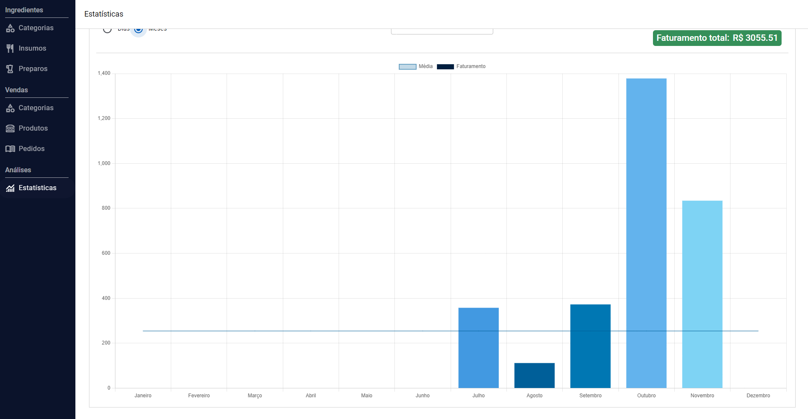

# Store Management API



  
  
  


## ⭐ Descrição Geral

A **Store Management API** é uma aplicação que oferece funcionalidades completas para o gerenciamento de insumos,
produtos, pedidos e estatísticas de vendas em uma loja. Abaixo estão as principais funcionalidades oferecidas:

### Insumos

- CRUD completo de insumos.
- Cada insumo possui nome e custo.

### Preparos

- Um tipo especial de insumo elaborado, composto por outros insumos.
- O custo de um preparo é calculado automaticamente com base nos insumos associados.

### Produtos

- CRUD completo de produtos.
- Associe insumos e/ou preparos a um produto.
- O custo total do produto será calculado com base nos custos de insumos e preparos.
- A partir do custo total, da margem de lucro desejada e das taxas variáveis um preço sugerido será adicionado ao
  produto,
  ajudando o gerenciador da loja a tomar a melhor decisão de precificação do seu produto.
- A margem de lucro será calculada com base no preço escolhido, nos custos e nas taxas variáveis

### Pedidos

- Visualize e delete pedidos existentes.
- Importe novos pedidos a partir de um arquivo JSON.

### Itens do Pedido

- Cada item está associado a um pedido e também a um produto.

### Estatísticas

- Obtenha informações detalhadas do desempenho da loja:
    - **Produtos mais vendidos**: Listagem calculada com base nos itens de todos os pedidos.
    - **Vendas por período**: Lista de todas as vendas feitas, agrupadas por dia ou por mês.

---

## 🚀 Como Rodar a Aplicação com Docker

Siga os passos abaixo para rodar a aplicação utilizando Docker:

1. Crie um arquivo `.env` contendo as seguintes informações:
    ```dotenv
    DB_URL=jdbc:postgresql://MY_DATABASE_HOST:MY_DATABASE_PORT/MY_DATABASE_NAME
    DB_USERNAME=MY_DATABASE_USER
    DB_PASSWORD=MY_DATABASE_PASSWORD
   ```
    - Substitua `MY_DATABASE_HOST`, `MY_DATABASE_PORT`, `MY_DATABASE_NAME`, `MY_DATABASE_USER` e `MY_DATABASE_PASSWORD`
      pelas informações do seu banco de dados

2. Ter o docker instalado
    ```shell
    docker build -t store-management-api .
    ```
3. Executar o script
    ```shell
    chmod +x docker-run.sh
    ./docker-run.sh
    ```
4. A aplicação estará disponível em: http://localhost:7808

## 📂 Estrutura de Pastas

Abaixo está a explicação da estrutura do projeto, com base na organização apresentada:

```yaml
src/main/java:
  domain:
    analytics:
      descrição: Lógica e funcionalidades relacionadas a estatísticas e relatórios.
    order:
      item:
        controllers: Controladores responsáveis pelas APIs de itens de pedido.
        dtos: Objetos de transferência de dados (DTOs) para itens.
        events: Eventos relacionados a itens.
        exceptions: Classes de exceções específicas.
        mappers: Mapeadores para conversão entre entidades e DTOs.
        models: Classes de modelo que representam entidades no banco de dados.
        repositories: Interfaces para comunicação com o banco de dados.
        services: Classes de serviço contendo a lógica de negócios.
      order:
        descrição: Diretório para lógicas gerais relacionadas a pedidos.
    preparation:
      ingredient: Relacionado a insumos usados nos preparos.
      preparation: Lógica específica para preparos, incluindo suas associações e custos.
    product:
      descrição: Contém lógicas e funcionalidades específicas para produtos.
    rawMaterial:
      descrição: Lógica para gerenciamento de insumos crus.
  general:
    StoreManagementApplication: Classe principal para execução da aplicação.
```

## 🛠️ Filtragem Avançada com Criteria API

A aplicação suporta uma funcionalidade altamente flexível de filtragem, implementada com a Criteria API. Os filtros
enviados do front-end seguem a seguinte estrutura:

```json
{
  "propertyName:operator": "value"
}
```

### Estrutura dos Filtros

propertyName: Pode ser tanto uma propriedade direta da entidade quanto uma propriedade aninhada. Exemplo de propriedade
aninhada:

```json
{
  "propertyName.internalPropertyName:operator": "value"
}
```

### Operadores Disponíveis:

```json
{
  "property:min": "date | number"
}
```

Aceita números ou datas. Retorna itens com valores acima do especificado.

```json
{
  "property:max": "date | number"
}
```

Aceita números ou datas. Retorna itens com valores abaixo do especificado.

```json
{
  "property:equal": "value"
}
```

Aceita valores booleanos, números, datas, strings, etc., dependendo do tipo da propriedade. Retorna itens com valores exatamente
iguais ao passado.

```json
{
  "property:search": "string"
}
```

Aceita strings e realiza uma busca case insensitive, retornando itens cuja propriedade contenha o valor fornecido. Útil
para buscas por nome.

```json
{
  "property:isNull": "anyValue"
}
```

Ignora o valor passado e retorna itens cuja propriedade esteja nula.

```json
{
  "property:hasAssociation": "boolean"
}
```

Retorna apenas itens que possuam ou não possuam associações com outra entidade definida na propriedade.

### Ordenação dos Resultados

Além dos filtros, a aplicação também suporta ordenação dos resultados utilizando os seguintes parâmetros:

```json
{
  "sortProperty": "property",
  "sortDirection": "asc | desc"
}
```

Essa abordagem de filtragem e ordenação flexível permite que o front-end forneça buscas complexas e detalhadas, tornando
a aplicação altamente adaptável a diferentes cenários de uso.

## Conclusão

Este projeto foi desenvolvido para oferecer uma solução completa para o gerenciamento de insumos, preparos,
produtos, pedidos e estatísticas em um ambiente de vendas. A estrutura modular e bem organizada do código facilita a
manutenção e a adição de novas funcionalidades, enquanto o uso de tecnologias modernas como Spring Boot, Docker,
PostgreSQL e Flyway garante desempenho, escalabilidade e confiabilidade.

Com a documentação e o suporte para execução via Docker, o projeto é de fácil configuração e pode ser rapidamente
integrado em diferentes ambientes. Além disso, a atenção aos detalhes nas funcionalidades e a clareza na estrutura do
código tornam esta aplicação uma base sólida para evoluções futuras.

Se você deseja expandir este sistema ou usá-lo como referência, este projeto é um exemplo prático e bem arquitetado.
Feedbacks, melhorias e contribuições são sempre bem-vindos!